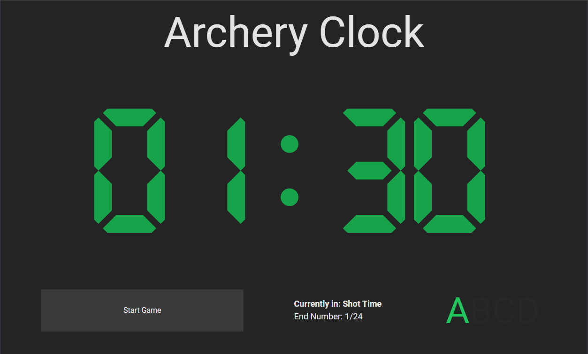

# Archery Clock - SBU Capstone

### Technologies Used

- **Frontend**: Built with React via Vite

- **CSS**: Tailwind

- **Backend**: Built with Node, Express

- **Database**: PostgreSQL

- **Authentication**: JWT

- **Testing**: Jest

- **UI Library**: React-Bootstrap

### Web Based Archery Shot timer with score-keeping. 

Provides 3 different shooting scenarios, whether you are shooting alone or with a partner, you can customize the clock to your game. 

Add in a pre-game countdown and/or practice ends to the beginning of your game. 

Modify timings for the clock. Includes 2 World Archery timings as a preset (30 seconds per arrow and 40 seconds per arrow).

Keep track of your scores and see how you rank up with archers around the world!

## API Documentation

### Backend Includes a custom API for shot tracking and user authentication. 

### User Routes

#### Register a new user
- **POST** `/users/register`
  - Body: `{ username, password }`
  - Returns: User object and sets JWT token in HTTP-only cookie

#### Authenticate user
- **POST** `/users/authenticate`
  - Body: `{ username, password }`
  - Returns: User object, game IDs, and sets JWT token in HTTP-only cookie

#### Logout
- **POST** `/users/logout`
  - Clears the token cookie
  - Returns: Success message

#### Get user's games
- **GET** `/users/:user_id/games`
  - Returns: Array of game IDs for the user

### Game Routes

#### Create a new game
- **POST** `/games/:user_id/new`
  - Body: `{ numOf_ends }`
  - Returns: New game object

#### Get game details
- **GET** `/games/:game_id`
  - Returns: Game object

#### Add a shot to a game
- **POST** `/games/:game_id/addShot`
  - Body: `{ score }`
  - Returns: Updated game object

## Archery Clock Database Schema

### Users table

Stores information about registered users of the application.

| Column      | Type         | Description                               |
|-------------|--------------|-------------------------------------------|
| id          | SERIAL       | Primary key, unique identifier for users  |
| username    | VARCHAR(50)  | Unique username for login                 |
| password    | VARCHAR(255) | Hashed password for security              |
| description | TEXT         | Optional user bio or description          |
| created_at  | TIMESTAMP    | Timestamp of user account creation        |

### Games table

Represents individual archery sessions or games.

| Column      | Type     | Description                                   |
|-------------|----------|-----------------------------------------------|
| id          | SERIAL   | Primary key, unique identifier for games      |
| user_id     | INTEGER  | Foreign key referencing the Users table       |
| game_date   | DATE     | Date of the game (defaults to current date)   |
| numOf_ends  | INTEGER  | Number of ends in the game (default 24)       |
| created_at  | TIMESTAMP| Timestamp of game creation                    |

### Ends table

Represents a single end (round) within a game.

| Column      | Type     | Description                                   |
|-------------|----------|-----------------------------------------------|
| id          | SERIAL   | Primary key, unique identifier for ends       |
| game_id     | INTEGER  | Foreign key referencing the Games table       |
| archer_char | CHAR(1)  | Identifier for the archer (e.g., 'A', 'B')    |
| end_num     | INTEGER  | Number of the end within the game             |
| numOf_shots | INTEGER  | Number of shots in this end (default 3)       |
| created_at  | TIMESTAMP| Timestamp of end creation                     |

Note: There's a unique constraint on (game_id, end_num) to ensure no duplicate ends within a game.

### Shot table

Stores individual shot data for each end.

| Column      | Type     | Description                                   |
|-------------|----------|-----------------------------------------------|
| shot_id     | SERIAL   | Primary key, unique identifier for shots      |
| end_id      | INTEGER  | Foreign key referencing the Ends table        |
| shot_number | INTEGER  | Number of the shot within the end             |
| score       | INTEGER  | Score for this shot                           |
| created_at  | TIMESTAMP| Timestamp of shot recording                   |

Note: There's a unique constraint on (end_id, shot_number) to ensure no duplicate shots within an end.

## Relationships

- A User can have multiple Games (one-to-many)
- A Game consists of multiple Ends (one-to-many)
- An End contains multiple Shots (one-to-many)

### Based on the desktop app - [archeryclock.com](https://archeryclock.com)

